# Use-case'ы
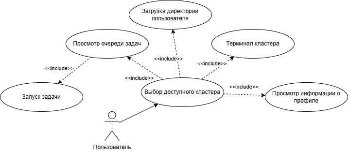
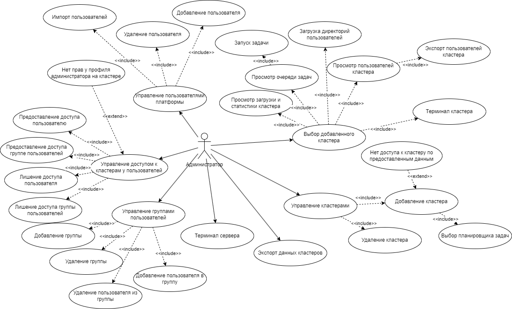

# Интерфейс

## Скрин
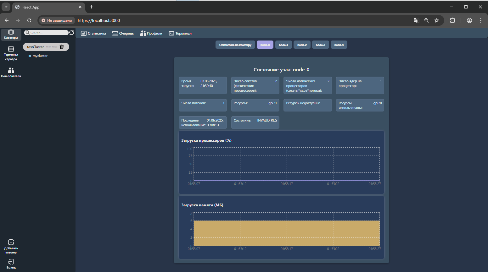

## Диаграмма
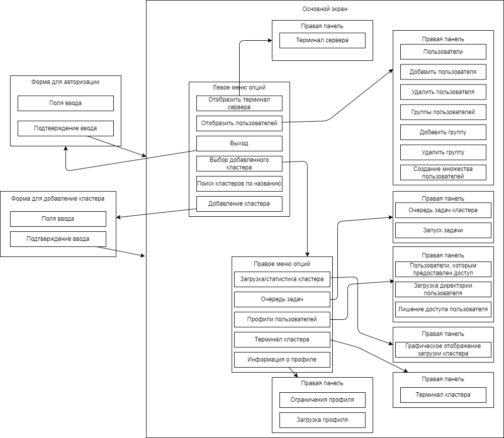

# Диаграмма модели предметной области
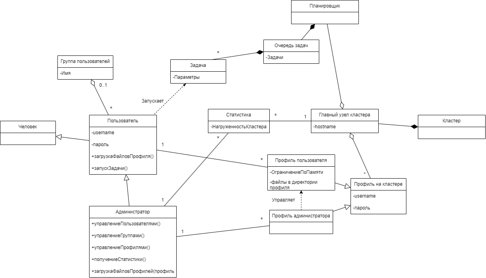

# Процессы 
## 1. Процесс авторизации
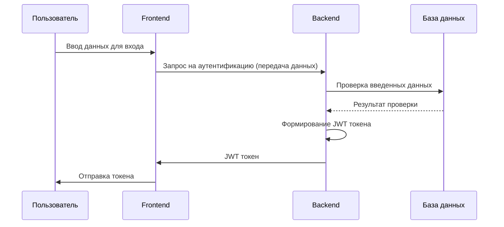

## 2. Процесс взаимодействия для управления пользователями
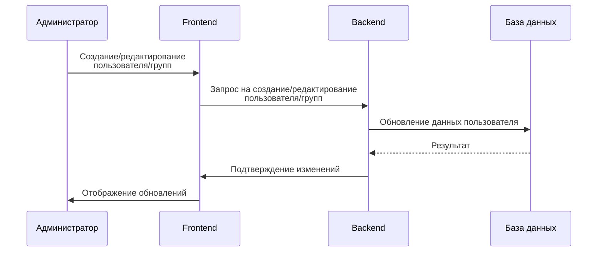

## 3. Процесс взаимодействия для управления пользователями на кластере
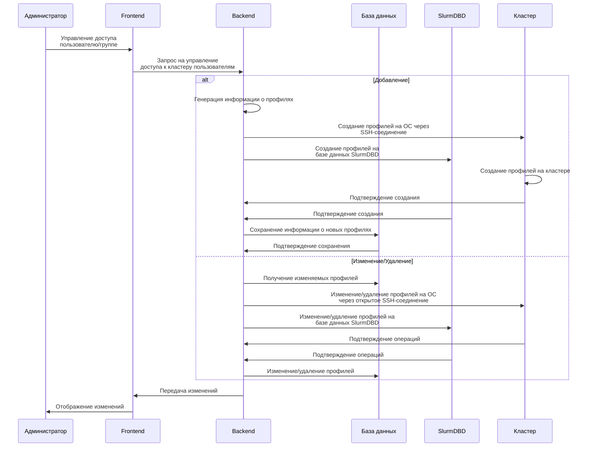

## 4. Управление задачами
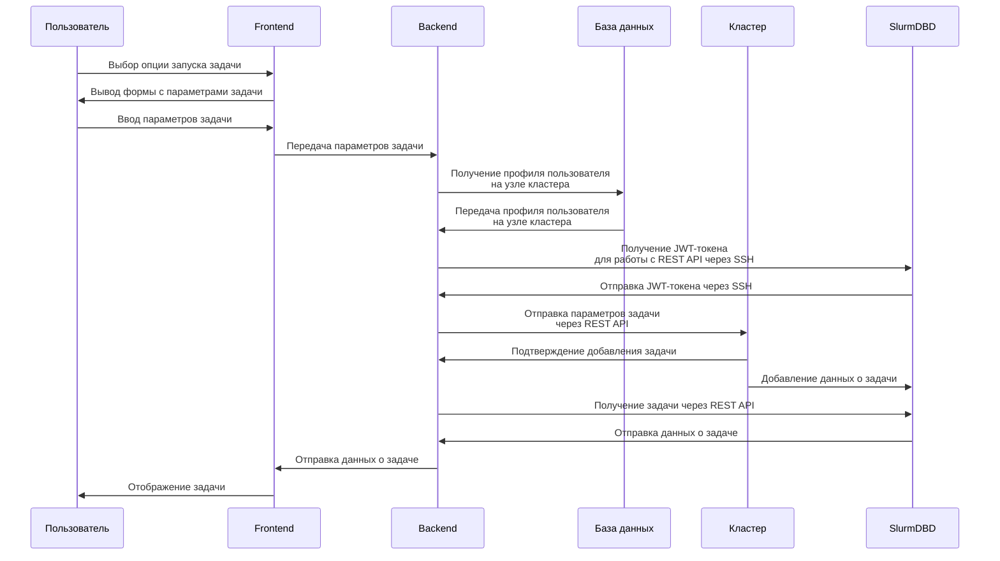

## 5. Загрузка директории пользователя
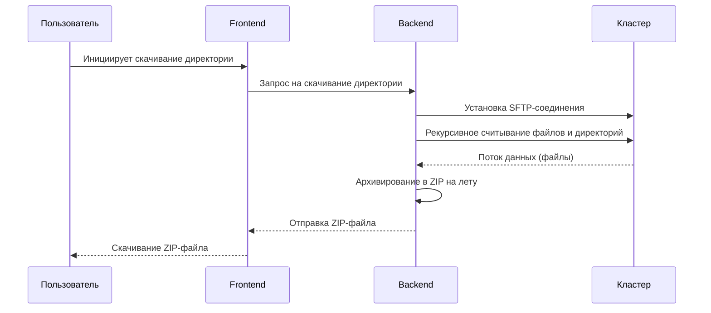

## 6. Взаимодействие для мониторинга
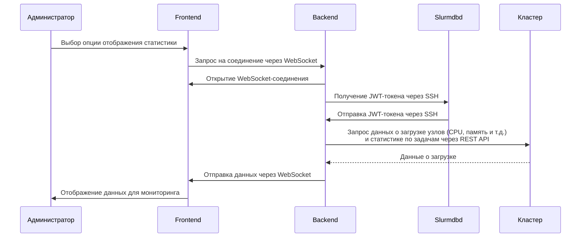
## 7. Взаимодействие для терминала
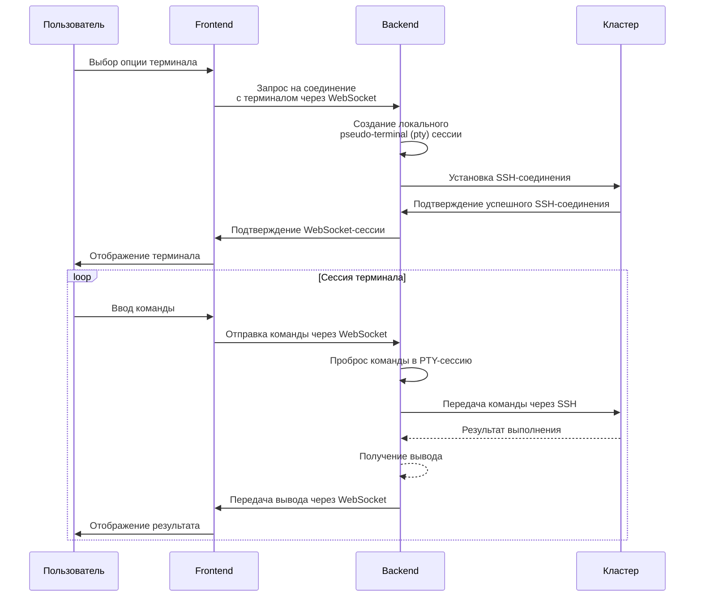